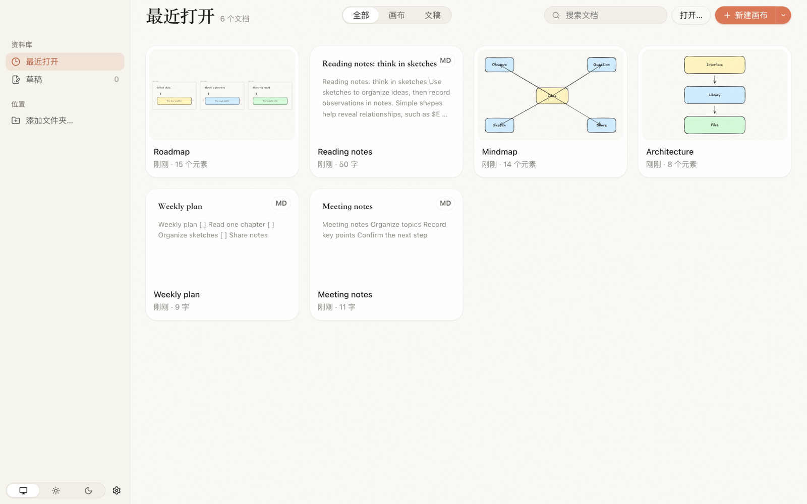
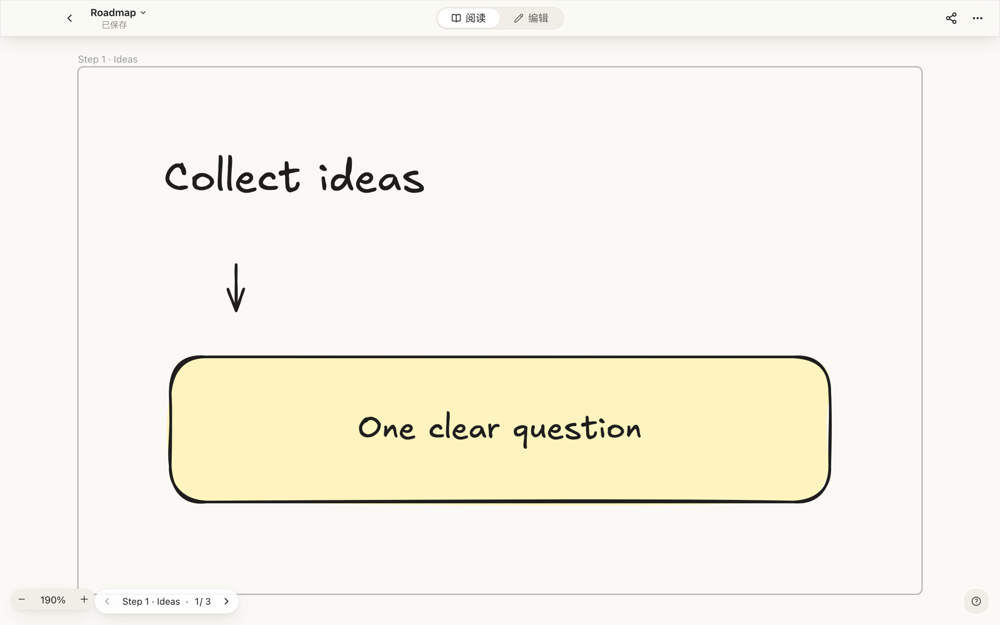
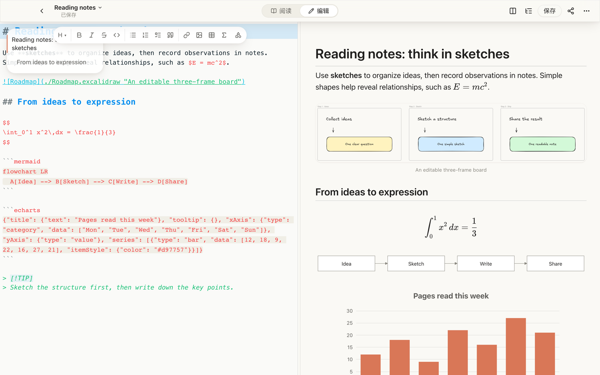
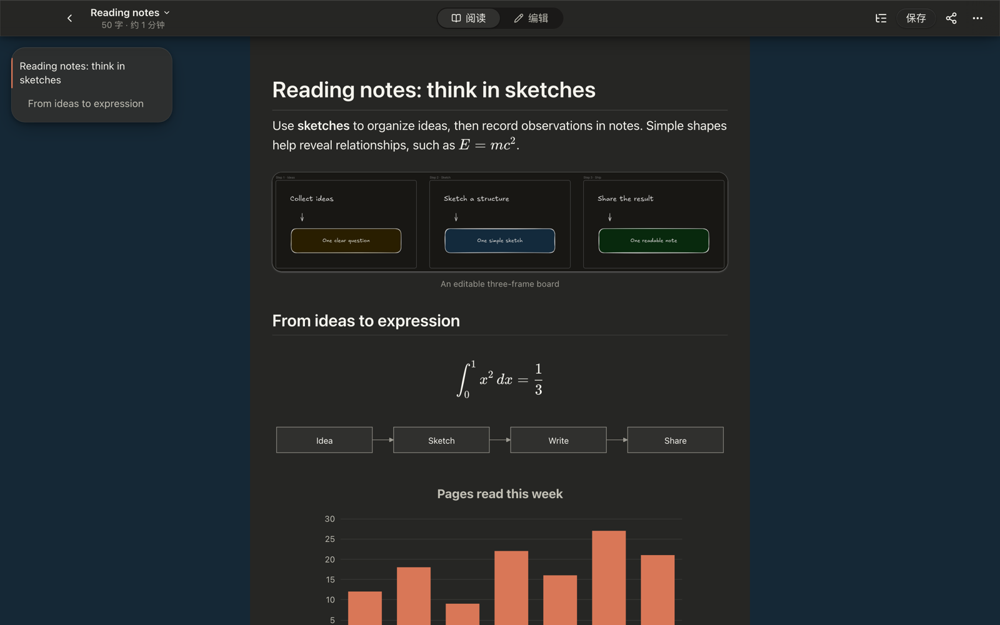

# Folio

[简体中文](README.zh-CN.md)

A macOS reader and editor for Excalidraw canvases and Markdown, in one library.



| Canvas reading                                                                                                                                                 | Markdown reading                                                                                                                                                                              |
| -------------------------------------------------------------------------------------------------------------------------------------------------------------- | --------------------------------------------------------------------------------------------------------------------------------------------------------------------------------------------- |
| <br>Read Excalidraw canvases and navigate Frames as pages.  | <br>Read Markdown with embedded canvases, formulas, diagrams and charts. |
| <br>Edit Markdown with a side-by-side preview. | <br>Read documents with dark appearance.                                     |

## Features

- **Canvases:** navigate Frames as pages, export PNG or SVG with editable scene data, and copy PNG to the clipboard.
- **Markdown:** embed local Excalidraw canvases, render KaTeX formulas, Mermaid diagrams and ECharts charts locally, browse an outline, and find text within a document.
- **Publishing:** export Markdown as standalone HTML or PDF, or copy content with inline styles for the WeChat Official Accounts editor.
- **Images:** paste into an `assets` folder beside the document, or upload through a local PicGo service or a configured uPic installation.
- **Library:** browse recent files, drafts and selected folders in one place.
- **Reading and editing:** documents open in reading mode; editing automatically saves file changes when autosave is enabled (the default).
- **Preferences:** light/dark/system appearance, reading width, split editing layout, line numbers and image storage.

## Language

The interface is currently available in Simplified Chinese only. Contributions for localization are welcome.

## Known limitations

- Relative paths for embedded canvases do not currently support filenames containing spaces; for example, `` will not render.
- Mermaid's default layouts are supported. ELK layout is unavailable in Folio builds; see [third-party notices](THIRD_PARTY_NOTICES.md).

## Install from source

Requires macOS on Apple Silicon (arm64) and Node 22+ with npm.

```sh
npm install
npm run package:app
```

The application is written to `dist/Folio.app`. Only macOS arm64 is configured for packaging.
The app is not distributed with a Developer ID signature or notarization. On first launch, allow it in **System Settings → Privacy & Security**, or right-click the app and choose **Open**.

## Development

```sh
npm run dev          # Electron desktop app with HMR
npm run dev:web      # Browser development server
npm run typecheck
npm test
npm run build        # Desktop build in out/
```

The browser version downloads files when saving and does not support PDF export.
Visit `/?gallery` in development to view the component gallery.
For contribution requirements, see [CONTRIBUTING.md](CONTRIBUTING.md).

## Privacy & network

Formulas, Mermaid diagrams and ECharts charts render locally without public rendering services.
Excalidraw fonts are bundled locally. Remote images in Markdown may still load directly from their hosts.
Local image assets are read only from authorized directories: the parent directories of opened documents and folders added to the library. Both the `folio-asset` protocol and `asset:read` apply this check.

Image uploads connect to the local PicGo service or invoke the configured uPic program.
Those tools upload images to their configured image hosts. HTML export preserves remote image URLs.
PDF export allows remote image requests but blocks remote scripts, stylesheets and fonts.

## Architecture

See [docs/ARCHITECTURE.md](docs/ARCHITECTURE.md) for the process boundaries, document adapters, persistence, asset access and export pipelines.

## Contributing

Bug reports, feature requests and focused pull requests are welcome.
Read [CONTRIBUTING.md](CONTRIBUTING.md) and the [Code of Conduct](CODE_OF_CONDUCT.md) before contributing.

## Security

Report vulnerabilities through GitHub private vulnerability reporting. See [SECURITY.md](SECURITY.md).

## License

Folio is licensed under **GPL-3.0-or-later**. See [LICENSE](LICENSE) for the full GPL version 3 text.
Third-party software and fonts retain their own licenses; see [THIRD_PARTY_NOTICES.md](THIRD_PARTY_NOTICES.md).
