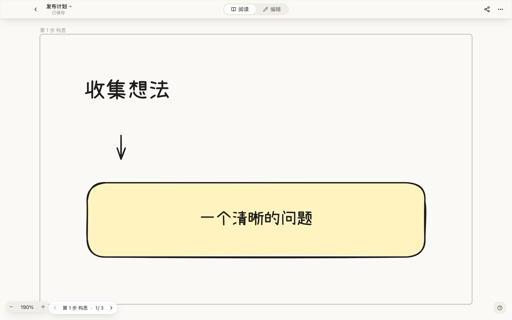
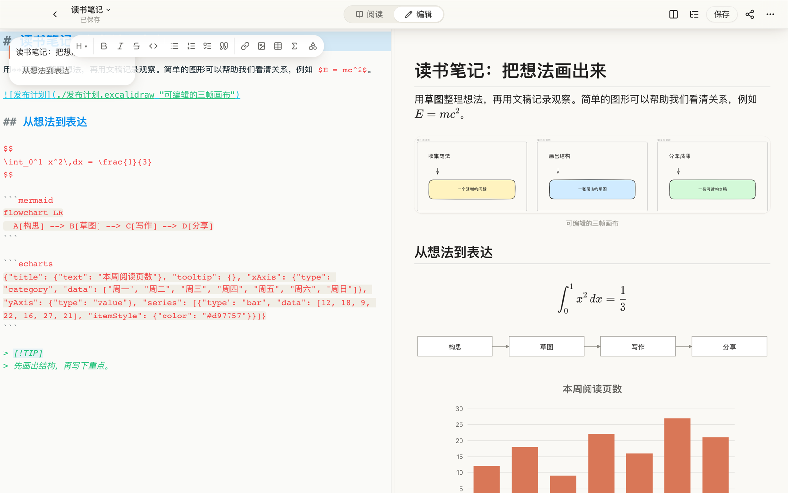

# Folio

[English](README.md)

Folio 是面向 macOS 的 Excalidraw 画布与 Markdown 文稿阅读、编辑器，在同一个资料库中管理两种文档。


| 画布阅读                                                                                                                      | 文稿阅读                                                                                                                                  |
| ----------------------------------------------------------------------------------------------------------------------------- | ----------------------------------------------------------------------------------------------------------------------------------------- |
| <br>阅读 Excalidraw 画布，按 Frame 翻页浏览。 | <br>在 Markdown 中阅读嵌入画布、公式、流程图与图表。 |
| <br>分栏编辑 Markdown，同时查看预览。            | <br>使用深色外观阅读文稿。                              |

## 主要功能

- **画布：** Frame 翻页、导出带可编辑场景数据的 PNG / SVG、复制 PNG 到剪贴板。
- **文稿：** Penna 排版与编辑，嵌入本地 Excalidraw 画布，本地 KaTeX 公式、Mermaid 流程图及 ECharts 图表，目录与页内查找。
- **发布：** 导出独立 HTML / PDF，或复制带内联样式的内容到微信公众号编辑器。
- **图片：** 粘贴到文稿旁的 `assets` 文件夹，或通过本机 PicGo 服务、用户配置的 uPic 上传。
- **资料库：** 在同一界面浏览最近文件、草稿和所选文件夹。
- **阅读与编辑：** 打开文件默认进入阅读模式；切换到编辑模式后，在启用自动保存时自动写回原文件（默认启用）。
- **设置：** 浅色 / 深色 / 系统外观、阅读宽度、分栏编辑布局、行号、图片保存方式及对应的 PicGo / uPic 配置。

## 界面语言

界面目前仅提供简体中文，欢迎参与多语言支持。

## 已知限制

- 嵌入画布的相对路径暂不支持包含空格的文件名，例如 `` 不会渲染。
- 支持 Mermaid 默认布局。Folio 构建不提供 ELK 布局，详情见[第三方声明](THIRD_PARTY_NOTICES.md)。

## 从源码安装

需要 Apple Silicon（arm64）Mac、Node 22+ 和 npm。

```sh
npm install
npm run package:app
```

桌面产物位于 `dist/Folio.app`，目前只配置了 macOS arm64 打包。
应用没有 Developer ID 签名，也未公证。首次打开可能需要在「系统设置 → 隐私与安全性」放行，或右键应用选择「打开」。

## 开发

```sh
npm run dev          # 带 HMR 的 Electron 桌面版
npm run dev:web      # 浏览器开发服务器
npm run typecheck
npm test
npm run build        # 桌面构建产物位于 out/
```

浏览器版保存时下载文件，PDF 导出仅桌面版支持。在开发环境访问 `/?gallery` 可查看组件画廊。
贡献前的检查要求见 [CONTRIBUTING.md](CONTRIBUTING.md)。

## 隐私与网络

公式、Mermaid 流程图和 ECharts 图表全部在本地渲染，不访问公网渲染服务。Excalidraw 字体随应用附带，在本地加载。
文稿中的远程图片仍可能由阅读器直接加载。本地图片资源读取仅限已授权目录：已打开文稿的父目录和加入资料库的文件夹；`folio-asset` 协议与 `asset:read` 都执行此检查。

图床上传只连接本机 PicGo 服务，或调用用户配置的 uPic 程序；使用这两项时，图片由对应工具上传到其配置的图床。
HTML 导出保留远程图片地址；PDF 导出只允许远程图片请求，不请求远程脚本、样式或字体。

## 架构

[docs/ARCHITECTURE.md](docs/ARCHITECTURE.md) 介绍进程结构、模块职责、文档适配器、持久化、资源授权和导出管线。

## 参与贡献

欢迎问题报告、功能建议和范围明确的 PR。请阅读 [CONTRIBUTING.md](CONTRIBUTING.md) 与[行为准则](CODE_OF_CONDUCT.md)。

## 安全

请通过 GitHub 私密漏洞报告提交安全问题，流程见 [SECURITY.md](SECURITY.md)。

## 许可证

Folio 使用 **GPL-3.0-or-later** 许可证，GPL 第 3 版完整文本见 [LICENSE](LICENSE)。
第三方软件和字体保留各自的许可证，详见 [THIRD_PARTY_NOTICES.md](THIRD_PARTY_NOTICES.md)。
