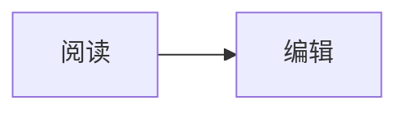

# Folio 文稿排版样张

这一页用于检查 **加粗**、_斜体_、~~删除线~~、[链接](https://example.com) 和 `行内代码`。中文 English 123 混排。

## 标题二：结构

### 标题三

#### 标题四

##### 标题五

###### 标题六

> 引用文字应该安静地靠在纸页左边。

- 无序列表
  - 嵌套项目
- [ ] 未完成任务
- [x] 已完成任务

1. 有序项目
2. 第二项

| 项目 | 数值 | 说明       |
| ---- | ---: | ---------- |
| 阅读 | 1284 | 中英混排   |
| 编辑 |    2 | 分栏与源码 |

---

行内公式 $E=mc^2$ 与行间公式：

$$
\int_0^1 x^2\,dx = \frac{1}{3}
$$



```echarts
{"title":{"text":"一周阅读字数"},"tooltip":{},"xAxis":{"type":"category","data":["周一","周二","周三","周四","周五","周六","周日"]},"yAxis":{"type":"value"},"series":[{"type":"bar","data":[1200,1800,950,2200,1600,2700,2100]}]}
```

```typescript
const greeting = "你好，Folio";
console.log(greeting);
```


> [!NOTE]
> 这是提示块。

> [!TIP]
> 这是技巧提示。

> [!IMPORTANT]
> 这是重要提示。

> [!WARNING]
> 这是警告。

> [!CAUTION]
> 这是谨慎提示。

<details><summary>折叠内容</summary>展开后可看到更多文字。</details>

::: card
卡片扩展示例。
:::

::: tabs
标题一 | 标题二
内容一 | 内容二
:::

::: steps

1. 第一步
2. 第二步
   :::

::: timeline
2026-09-25：Folio 文稿基座。
:::

`badge` 徽标与一张内嵌图片：
